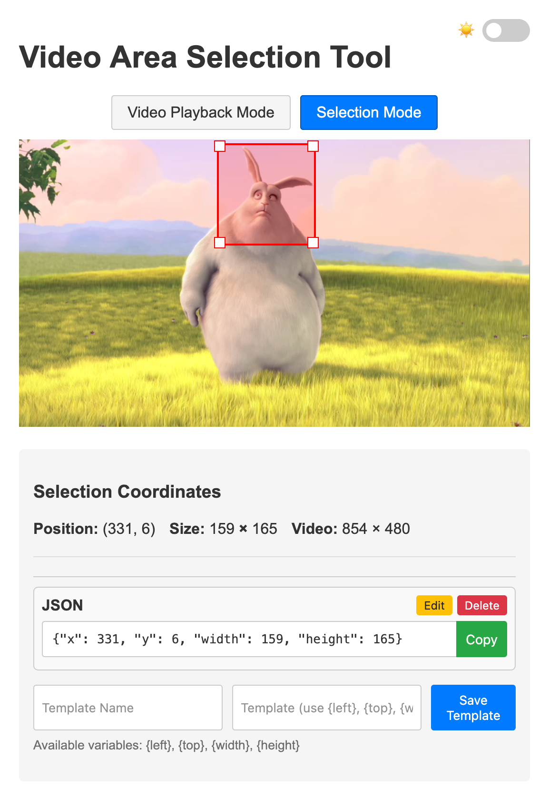

# Video Area Selection Tool

A lightweight web application that allows you to select and extract specific regions of a video. Perfect for creating cropped video clips, extracting coordinates for video processing, or preparing video regions for other applications.

> [!NOTE]
> This project was created with the assistance of AI tools. The code may not follow best practices and could contain suboptimal solutions.



## Features

- **Area Selection**: Precisely select and resize rectangular areas within a video
- **Coordinate Extraction**: Get exact pixel coordinates of your selection
- **Template System**: Create and save custom output formats for your coordinates
- **Dark/Light Mode**: Comfortable viewing in any environment
- **Keyboard Controls**: Efficient video navigation with keyboard shortcuts
- **No Server Required**: Works entirely in your browser without uploading videos
- **Modular Design**: Core functionality available as a reusable library

## Project Structure

The project has been refactored to separate concerns:

```
video-select-area/
├── index.html                      # Main application 
├── css/
│   ├── styles.css                  # Main application styles
│   └── video-area-selector.css     # Core library styles
├── js/
│   ├── app.js                      # Main application logic
│   ├── templates.js                # Template system logic
│   ├── theme-handler.js            # Theme handling logic
│   └── lib/
│       └── video-area-selector.js  # Core reusable library
└── README.md
```

## Using the Core Library

You can use the core video area selection functionality in your own projects:

```html
<!-- Include the core library styles -->
<link rel="stylesheet" href="path/to/video-area-selector.css">

<!-- Your video element -->
<div id="myVideoContainer">
    <video id="myVideo" src="video.mp4" controls></video>
</div>

<!-- Include the core library script -->
<script src="path/to/video-area-selector.js"></script>
<script>
    // Initialize the video area selector
    const videoElement = document.getElementById('myVideo');
    const selector = new VideoAreaSelector({
        videoElement: videoElement,
        onChange: (selectionData) => {
            console.log('Selection changed:', selectionData);
            // selectionData contains both absolute and relative coordinates
        }
    });

    // Enable selection mode
    selector.enable();
    
    // Later, you can disable it
    // selector.disable();
    
    // Get the current selection programmatically
    const selection = selector.getSelection();
    
    // Set a selection programmatically
    selector.setSelection({
        left: 100,
        top: 50,
        width: 320,
        height: 240
    });
</script>
```

## How to Use

1. Open `index.html` in your web browser
2. Drag and drop a video file into the drop area, or click to select from your file system
3. Switch between "Video Playback Mode" and "Selection Mode" using the buttons above the video
4. In Selection Mode:
   - Click and drag on the video to create a selection area
   - Use the corner handles to resize the selection
   - View the precise coordinates in the "Selection Coordinates" section
5. Create templates to format the coordinate output as needed

## Keyboard Shortcuts

- **Space**: Play/Pause video
- **Left Arrow**: Step back (hold Shift for larger step)
- **Right Arrow**: Step forward (hold Shift for larger step) 
- **M**: Toggle between Playback and Selection modes

## Template System

The template system allows you to create custom output formats using your selection coordinates. 
Available variables:
- `{left}` - Left position of selection
- `{top}` - Top position of selection
- `{width}` - Width of selection
- `{height}` - Height of selection
- `{right}` - Right margin
- `{bottom}` - Bottom margin
- `{leftRel}`, `{topRel}`, `{widthRel}`, `{heightRel}`, `{rightRel}`, `{bottomRel}` - Relative values (0-1)

Example templates:
- CSS: `left: {left}px; top: {top}px; width: {width}px; height: {height}px;`
- JSON: `{"x": {left}, "y": {top}, "width": {width}, "height": {height}}`
- ffmpeg crop: `crop={width}:{height}:{left}:{top}`

## Contributing

Feel free to fork this project and submit pull requests for any improvements you make.

## License

[MIT License](LICENSE)
